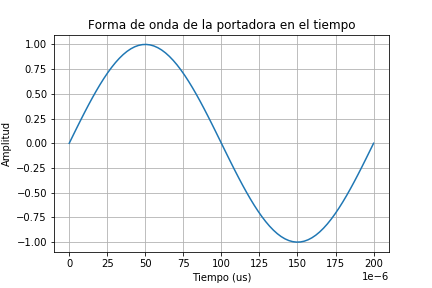
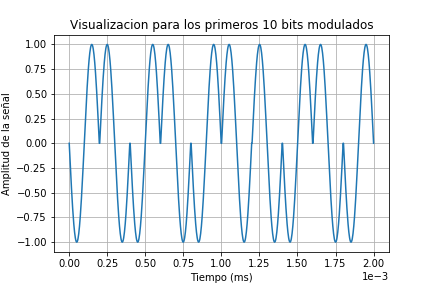
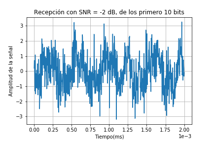
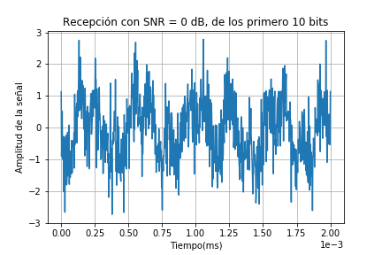
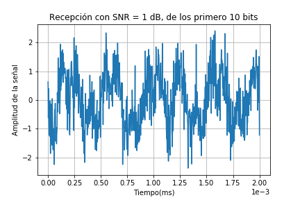
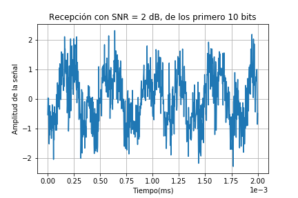
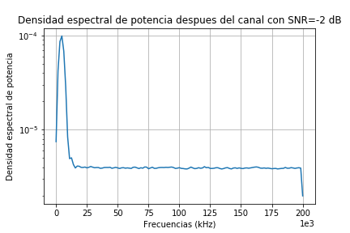
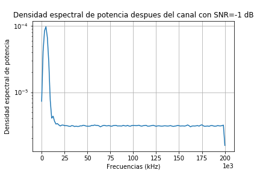
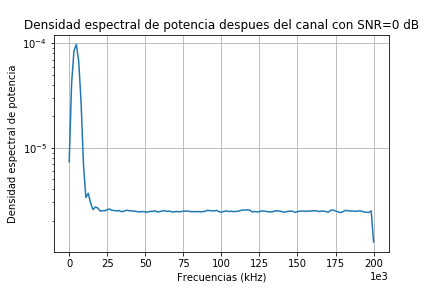
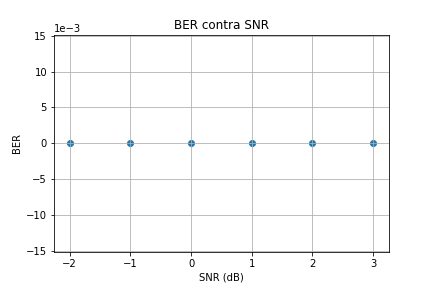

# Tarea 4 - Procesos aleatorios
## Erick Sancho Abarca B77145
Solución de la **tarea 4** para el curso *IE0405 - Modelos Probabilísticos de Señales y Sistemas*

#### 1. Esquema de modulación BPSK

Se definió la frecuecia de la onda portadora como 5 kHz, por lo tanto se tiene un peridodo de 0.2 ms o 200us, además se establecieron 80 puntos de muestreo por periodo. Entonces de estos valores se obtuvo una gráfica en la que visualizamos la forma de onda de la portadora para un periodo, entonces obtenemos:

Seguidamente se procedió a obtener la modulación BPSK de los bits del archivo `bits10k.csv`. La modulación BPSK (Binary Phase Shift Keying o modulación binaria por desplazamiento de fase) es una modulación que opera sobre la fase de la señal de la portadora, donde un bit "1" se codifica con fase 0 grados y un bit "0" se codifica con una fase de 180 grados. Entonces se aplica esta definición para obtener la modulación de los bits del archivo `bits10k.csv`. Entonces para los primeros 10 podemos graficar la señal modulada como:

#### 2. Potencia promedio de la señal modulada

En esta sección calculamos la potencia de la señal modulada, para ello empleamos la función `integrate.trapz`, con lo cual se obtuvo una potencia de 0.4937506171882715 W.

#### 3. Simular un canal ruidoso del tipo AWGN (ruido aditivo blanco gaussiano) con una relación señal a ruido (SNR) desde -2 hasta 3 dB.

En esta sección obtenemos la señal modulada después del canal para los diferentes valores de relación de señal-ruido (SNR) los cuales varían desde -2 dB hasta 3 dB, entonces obtenemos las siguientes señales despues del canal ruidoso:

#### 4. Graficar la densidad espectral de potencia de la señal con el método de Welch (SciPy), antes y después del canal ruidoso.

En esta sección se emplea la función `signal.welch`, para obtener la densidad espectral de potencia de señal antes y después del canal para todos los valores de SNR, entonces primero obtenemos la curva para la densidad espectral de potencia para antes del canal:

Ahora obtenemos las curvas de densidad espectral de potencia después del canal para los diferetes valores de SNR:

#### 4.Demodulación y decodificación de la señal, hacemos un conteo de la tasa de error de bits (BER, bit error rate) para cada nivel SNR.

En esta sección se realiza la demodulación de las gráficas de recepción, para los diferentes valores de SNR, para ello empleamos la decodificación de la señal por detección de energía, en la cual calculamos la pseudo-energía de la señal recibida, en este punto establecemos un criterio de evaluación basado en el criterio de producto interno, donde si las funciones son ortogonales su valor es cero, por lo tanto establecemos como criterio de comparación un cero ya que si "Ep" es igual a cero este será ortogonal a la onda original entonces equivale a un bit "0", lo cual es caso contrario para "Ep" mayor que cero, el cual equivale a un bit "1". Entonces a partir de este criterio de evaluación obtenemos una lista con los bits decodificados. Entonces para calcular el error se emplea `err = np.sum(np.abs(bits - bitsRX))`, donde `bits` son los bits originales y `bitsRX` son los bits de los bits decodificados. Sin embargo en todos los casos obtenimos un error cero es decir no hubo ningun bit "mal", para todos lo valores de SNR

#### 6. Gráfica de BER versus SNR

En esta sección se obtuvo la gráfica que relaciona la tasa de error con el valor de SNR, donde BER se obtiene como la cantidad de errores entre la cantidad de bits. Entonces para este caso obtenemos lo siguiente:

